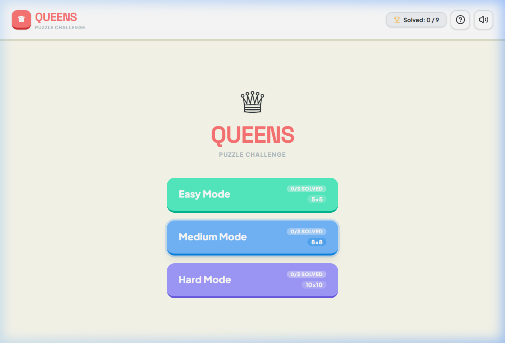
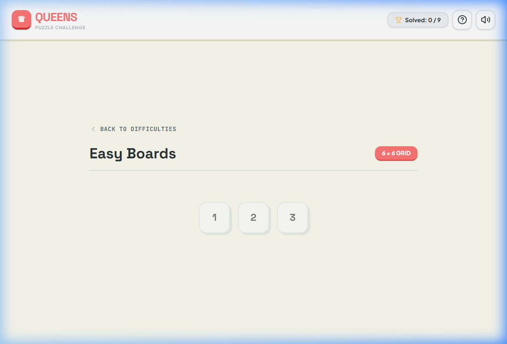
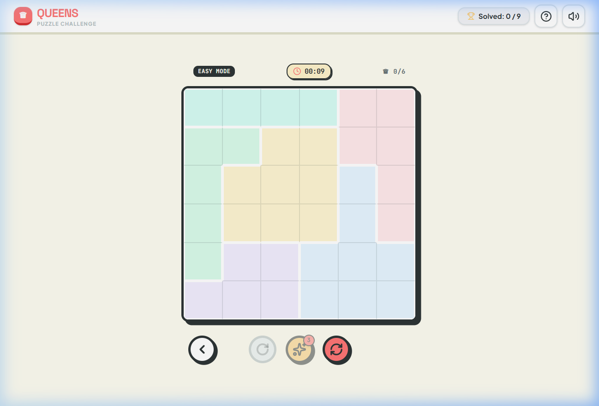
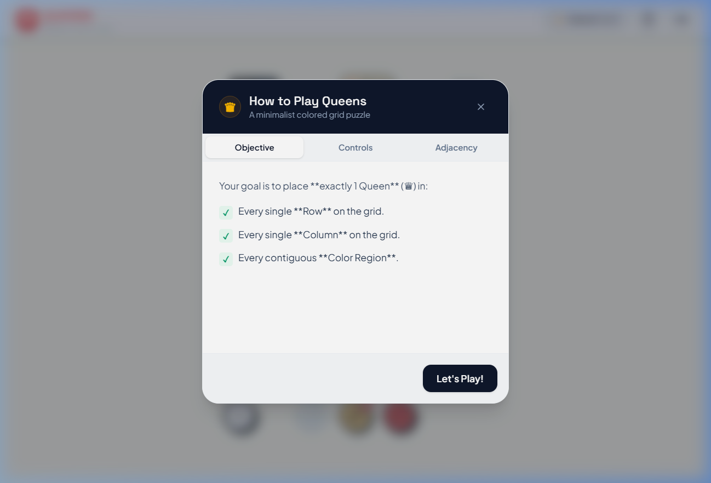

# 👑 Queens Puzzle Challenge

An interactive, responsive web-based adaptation of the classic logic grid puzzle (popularized by LinkedIn Queens). The game challenges players to place queens on a grid according to strict row, column, region, and adjacency constraints. Designed with soft pastel color palettes, visual assists, and satisfying audio feedback.

---

## 📷 Game Visuals

Here is what the game looks like in action:

| 🏠 Main Menu | 🗺️ Level Selector |
| :---: | :---: |
|  |  |
| Choose your difficulty: Easy, Medium, or Hard. | Browse and play unlocked and solved levels. |

| 🎮 Active Gameplay | 📖 Tutorial & Rules |
| :---: | :---: |
|  |  |
| Interact with the grid and track real-time constraints. | Learn the ropes with the clear interactive guide. |

---

## 🎮 How to Play (Rules & Controls)

If you have never played a Queens puzzle before, don't worry! The objective is simple to learn but offers rich logic gameplay.

### 🏆 The Rules
Your goal is to place **exactly one Queen (♕)** in:
1. **Every Row** on the grid.
2. **Every Column** on the grid.
3. **Every Color Region** (contiguous areas of the same color).

**The Adjacency Restriction (Critical!):** 
* No two queens can touch each other in any direction—**not even diagonally**.
* A queen blocks all 8 adjacent cells surrounding it. If two queens touch, both will pulse red to alert you of the conflict.

### 🕹️ Controls (Cycling States)
You can toggle cells on the board using a mouse or touch screen:
* **Single Tap / Left Click**: Cycles a cell:
  `[Empty] ➡️ Dot (.) ➡️ Queen (♕) ➡️ [Empty]`
  * Use **Dots (`.`)** to mark cells where a queen cannot be placed.
  * Use **Queens (`♕`)** to place a queen.
* **Right Click** (Desktop Shortcut): Cycles directly to a queen or clears it:
  `[Empty] ➡️ Queen (♕) ➡️ Dot (.) ➡️ [Empty]`
* **Undo Button**: Tap the arrow button in the header to rollback your last move.

---

## 🌟 Premium Gameplay Features

To elevate the puzzle-solving experience, the game includes:
* **🎵 Web Audio Chimes**: Built-in sound effects generated on-the-fly using the browser's native Web Audio API (no heavy audio files to load!). Plays pleasant tones for successful moves, errors, hints, and victory chords. Includes a mute button.
* **👁️ Auto Shadows (Line of Sight)**: An optional helper that automatically shades rows, columns, adjacent cells, and color regions blocked by placed queens. Perfect for scanning the board for valid spots.
* **📊 Real-Time Constraint HUD**: A sidebar panel that tracks exactly how many queens are in each row, column, and color region, updating instantly.
* **⚠️ Pulse Conflict Detection**: Touch violations or region conflicts immediately highlight the offending queens in bright pulsing red.
* **🚫 Shaded Blocked Rows/Cols**: Rows/columns filled completely with dots will shade visually and play a sound after a 1-second delay.
* **💡 Logic Hints**: Includes 3 hints per puzzle. Requesting a hint highlights a correct queen location with a pulsing indicator for 3.5 seconds.
* **💾 Local Progress Save**: Game achievements are saved automatically in your browser's local storage (`localStorage`) so you never lose your solved count.

---

## 🛠️ Quick Local Setup (Get Started in 2 Minutes)

Follow these simple, step-by-step instructions to run the game on your device:

### 1. Prerequisites
Ensure you have the following installed on your machine:
* **Node.js** (Version 18.0.0 or higher is recommended)
* **Git** (optional, to clone the repo)

### 2. Download the Project
Clone the repository using Git:
```bash
git clone https://github.com/your-username/Queens.git
cd Queens
```
*Alternatively, you can download the repository as a **ZIP file** from GitHub, extract it, and open your terminal/command prompt inside the extracted folder.*

### 3. Install Dependencies
Run the command below to install the necessary libraries:
```bash
npm install
```

### 4. Run the Game
Start the local development server:
```bash
npm run dev
```

### 5. Play in Browser
Open your browser and navigate to:
👉 **[http://localhost:3000](http://localhost:3000)**

---

## 💻 Developer Notes & Architecture

For developers looking to inspect, modify, or extend the game, here is a detailed technical overview.

### 📁 Directory Layout
* `src/App.tsx`: Contains the core logic, state management (grid state, undo history, timers, statistics), event handlers (left/right click), sound chime engine, and UI layout.
* `src/types.ts`: Defines typescript schemas for cell contents, grid coordinates, stats, and board profiles.
* `src/data/boards.ts`: Contains predefined boards and solutions for easy (6x6), medium (8x8), and hard (10x10) modes.
* `src/components/`:
  * [BoardHUD.tsx](file:///c:/Users/aroma/Desktop/Projects/Kaggle/Queens/src/components/BoardHUD.tsx) - Handles constraint checking and warning display.
  * [SuccessCelebration.tsx](file:///c:/Users/aroma/Desktop/Projects/Kaggle/Queens/src/components/SuccessCelebration.tsx) - Handles confetti, timing stats, and navigation to the next levels on victory.
  * [Tutorial.tsx](file:///c:/Users/aroma/Desktop/Projects/Kaggle/Queens/src/components/Tutorial.tsx) - Interactive guidelines pop-up explaining objective and adjacency rules.
* `src/App.css` & `src/index.css`: Custom aesthetic variables, animations (pulsing effects, next-level slides), and styling imports.

### 🔑 Tech Stack & Dependencies
* **Core**: React 19.0.0 + TypeScript 5.8
* **Styling**: Tailwind CSS v4.0 for utility classes + Custom Vanilla CSS animations.
* **Animations**: Motion (formerly Framer Motion) for page transitions, celebratory popups, and levels drawer.
* **Icons**: Lucide React.
* **Build System**: Vite 6.2 with Hot Module Replacement (HMR).

### 💡 Notable Code Implementations
1. **Dynamic Web Audio**: Audio effects are generated using native `OscillatorNode` objects with sine, triangle, and sawtooth waves:
   ```typescript
   const ctx = new AudioContext();
   const osc = ctx.createOscillator();
   // Modulating frequency and gain over time for custom chimes
   ```
2. **Derived Board Analysis**: Grid evaluation is computed reactively. Row, column, and region allocations are evaluated in `O(N^2)` time on state updates, allowing instantaneous warning triggers.
3. **Inconsistency Note**: On the home menu, the difficulty selection labels Easy Mode as a `5x5` grid; however, the actual puzzle size defined in `boards.ts` is `6x6` cells. Developers can adjust the size label in `src/App.tsx` on line 740 to align the text.
